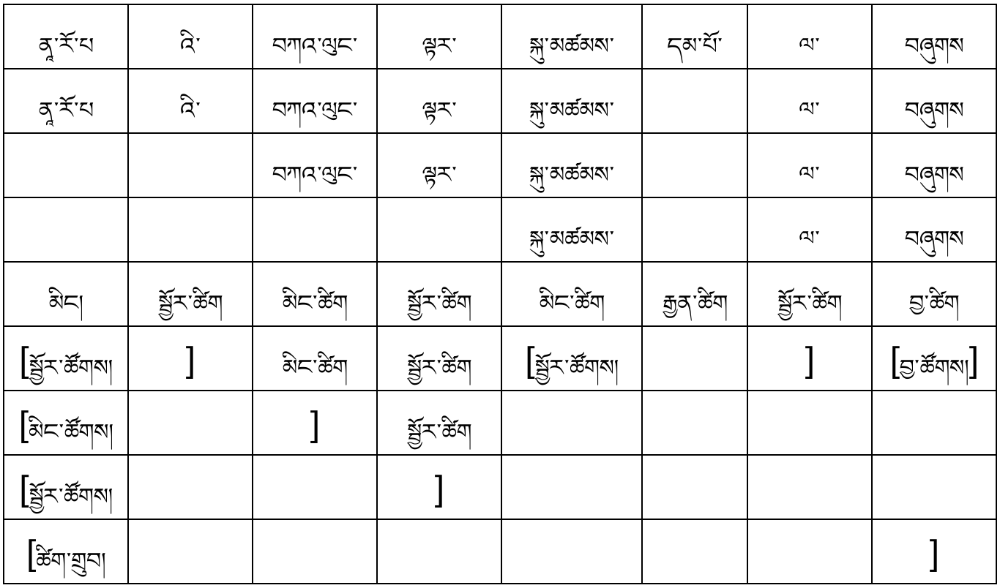
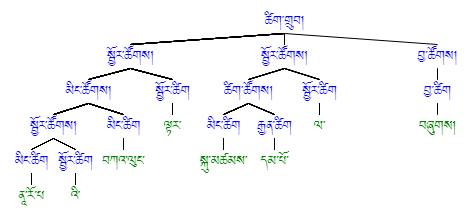

[<-back](bo/ཚིག་གཤིས་/UD_POS.md)

### ADJ: adjective རྒྱན་ཚིག ཁྱད་ཚིག

ཀ༽ དཔེར་བརྗོད།  
༡) ཆུ་བོ་ཆེན་པོ་བཞི་རྒྱ་མཚོར་བབས། (བུ་སྟོན་ལས་བཤུས།) 

 

༢) ནཱ་རོ་པའི་བཀའ་ལུང་ལྟར་སྐུ་མཚམས་དམ་པོ་ལ་བཞུགས། (མི་ལ་རས་པའི་རྣམ་ཐར་ལས་བཤུས།)

གཟུགས་མཛེས་མདོག་དཀར་པའི་མི་རིང་བ་དེས་སྐད་རིགས་བཞི་ཧ་ཅང་བདེ་ལེགས་ངང་བཤད་ཐུབ། (ཡོང་ཁུངས་རང་།) 

 