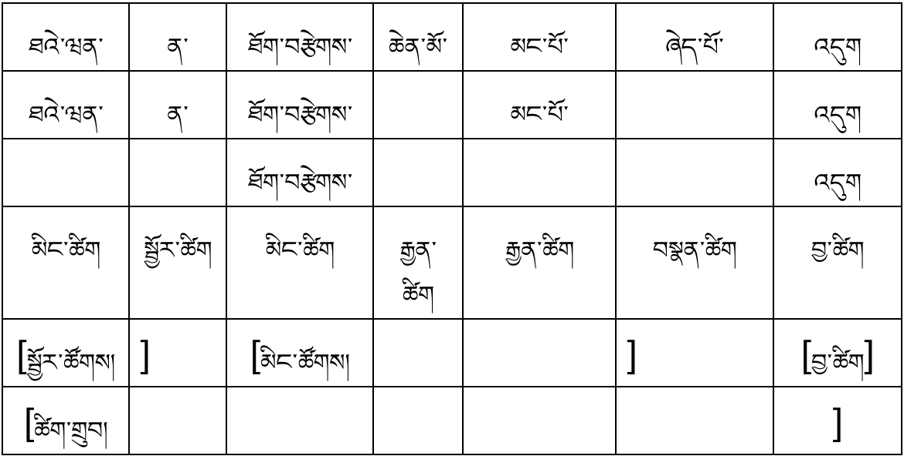
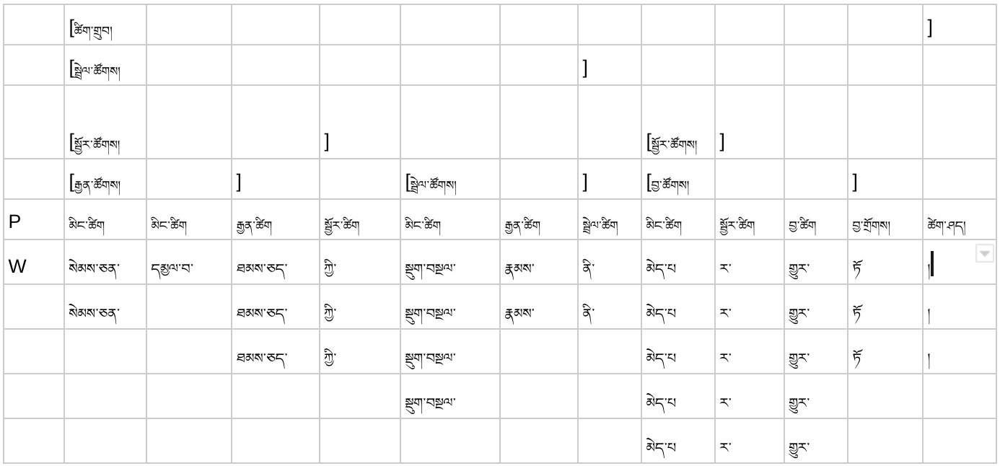
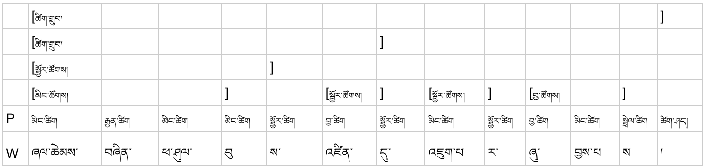
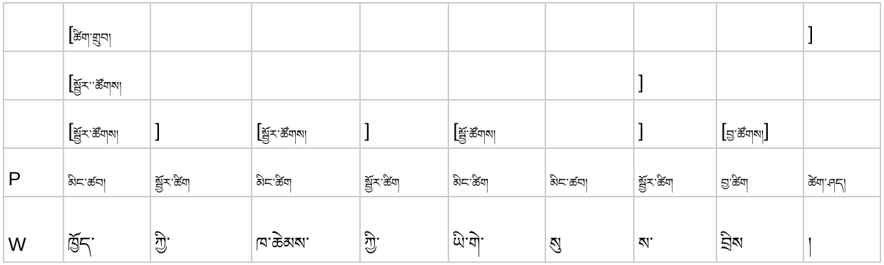

[<-back](bo/ཚིག་གཤིས་/UD_POS.md)

### ADP: adposition སྦྱོར་ཚིག

རང་གི་དཔེར་བརྗོད། ཐའེ་ཝན་ན་ཐོག་བརྩེགས་ཆེན་མོ་མང་པོ་ཞེད་པོ་འདུག

སེམས་ཅན་དམྱལ་བ་ཐམས་ཅད་ཀྱི་སྡུག་བསྔལ་རྣམས་ནི་མེད་པར་གྱུར་ཏོ། (འདུལ་བ།)

ཞལ་ཆེམས་བཞིན་ཕ་ཤུལ་བུས་འཛིན་དུ་འཇུག་པར་ཞུ་བྱས་པས།(མི་ལ་རས་པ)

ཁྱོད་ཀྱི་ཁ་ཆེམས་ཀྱི་ཡི་གེ་སུས་བྲིས།(མི་ལ་རས་པ)

