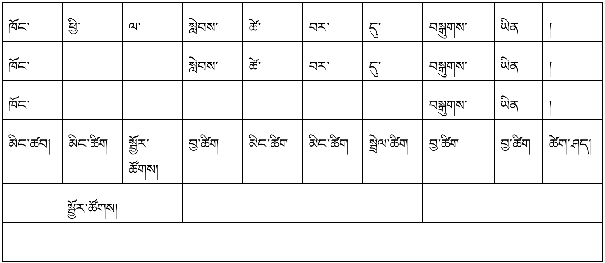
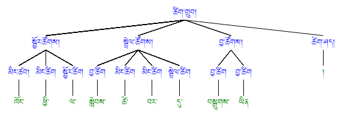

[<-back](bo/ཚིག་གཤིས་/UD_POS.md)

### SCONJ: subordinating conjunction ལྟོས་བཅས་སྦྲེལ་ཚིག
དཔེར་བརྗོད། (རང་གི) ཁོང་ཕྱི་ལ་སླེབས་ཚེ་བར་དུ་བསྒུགས་ཡིན།

(མཛངས་བླུན།) ཡང་དག་པར་བསྟན་པ་ན་གལ་ཏེ་གཞི་དེ་གཏོང་ན་དེ་ལྟ་ན་ལེགས། 

ཚེ་དང་ལྡན་པ་དག་ཤེས་བཞིན་དུ་བརྫུན་དུ་སྨྲ་བ་ནི་བཅོམ་ལྡན་འདས་ཀྱིས་བར་དུ་གཅོད་པའི་ཆོས་སུ་གསུངས། (འདུལ་བ།)

