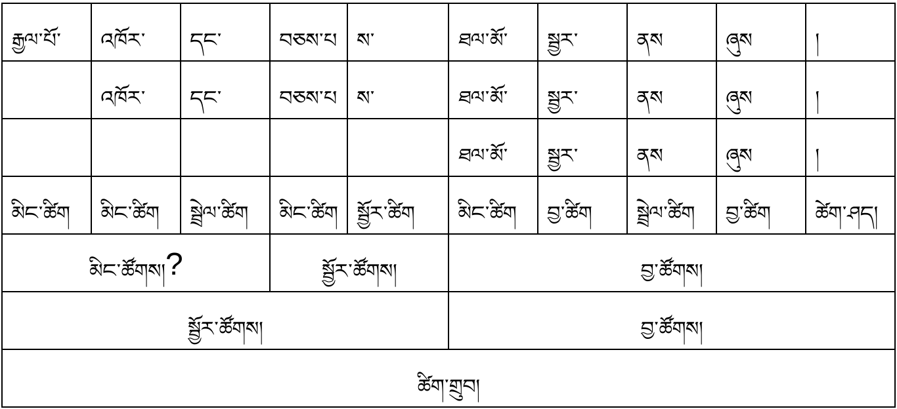
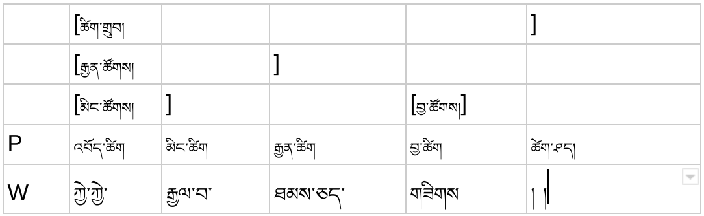
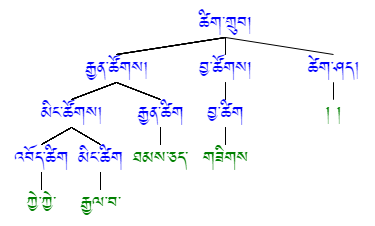

[<-back](bo/ཚིག་གཤིས་/UD_POS.md)

### INTJ: interjection འབོད་ཚིག
ཡོང་ཁུངས། (མར་པ་ལོ་ཙཱ།) རྒྱལ་པོ་འཁོར་དང་བཅས་པས་ཐལ་མོ་སྦྱར་ནས་ཞུས།

ཨེ་མ་ཧོ། ཉོན་ཅིག་དུར་ཁྲོད་བདག་མོ་ཁྱོད། །(རྒྱུད་འབུམ།)

ཀྱེ་ཀྱེ་རྒྱལ་བ་ཐམས་ཅད་གཟིགས། །(རྒྱུད་འབུམ།)

